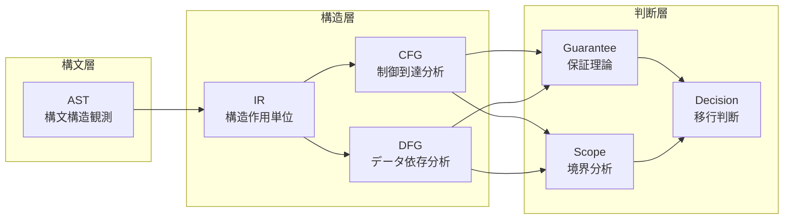

# COBOL構造解析による移行判断支援：抽象構文木・中間表現・グラフ理論に基づく包括的フレームワーク

**著者**: COBOL構造解析研究室  
**日付**: 2026年4月8日  
**所属**: COBOL Structure Analysis Lab

---

## 概要

レガシーCOBOLシステムは、複雑な制御フロー、複雑なデータ依存関係、数十年にわたって蓄積された技術的負債により、移行判断において重大な課題を提示する。従来の移行アプローチは、移行リスク、コスト、実現可能性に影響する深層のアーキテクチャ関係を考慮せず、主として構文レベルの検査に依存するため、しばしば失敗に終わる。

本論文では、複数の抽象化層を通じて進行するCOBOL構造解析の包括的フレームワークを提示する：構文観測のための抽象構文木（AST）、構造作用単位のための中間表現（IR）、制御到達可能性分析のための制御フローグラフ（CFG）、および依存関係追跡のためのデータフローグラフ（DFG）。これらの構造層を保証理論、スコープ分析、移行判断モデルに接続する形式理論を確立する。

我々の層別アプローチは、アドホックな評価ではなく構造的根拠を提供することにより、移行実現可能性の体系的評価を可能にする。本フレームワークは、移行成功に重大な影響を与える非構造化制御フロー、複合データ依存関係、スコープ横断転送などの高リスクパターンを特定する。この構造解析が、定量化可能な構造的性質に基づいて、ビッグバン方式から段階的Strangler Figパターンまでの移行戦略を直接的に導く方法を実証する。

本研究は以下を貢献する：（1）複数抽象化レベルにわたるCOBOL構造解析の形式的方法論、（2）制御・データフロー解析と移行判断理論の統合、（3）再現可能な移行評価を支援する85以上の精密定義された概念による包括的用語体系。

**キーワード**: COBOL, レガシーシステム, 移行分析, 制御フローグラフ, データフローグラフ, 構造解析, 移行判断支援

---

## 1. はじめに

### 1.1 問題設定

数十年にわたって蓄積された数百万行のコードを含むレガシーCOBOLシステムは、ソフトウェア移行において最も挑戦的なシナリオの一つを提示する。従来の構文レベル分析アプローチは、移行実現可能性、コスト、リスクを決定する複合的な構造関係を捉えることに失敗する。組織はしばしば以下の理由により移行失敗に直面する：

1. **不適切な構造理解**: 制御フロー複雑性、データ依存パターン、アーキテクチャ境界を考慮しない構文分析のみへの依存
2. **体系的リスク評価の欠如**: 移行成功に影響する重要な構造パターンを見逃すアドホックな評価手法
3. **理論的基盤の不足**: 構造解析を移行意思決定に接続する形式的フレームワークの不在

### 1.2 研究目的

本研究は、以下を通じてこれらの課題に対処するCOBOL構造解析の包括的フレームワークを確立する：

1. **多層構造解析**: 構文観測（AST）から構造作用単位（IR）を経てグラフベースモデル（CFG, DFG）への進行
2. **判断理論との統合**: 構造解析を保証理論、スコープ分析、移行判断モデルに接続
3. **形式的理論基盤**: 再現可能で比較可能な移行評価を可能にする概念の数学的形式化

### 1.3 研究範囲と限界

本研究は、移行判断支援のためのCOBOLプログラム静的解析に焦点を当てる。構造パターン、制御フロー複雑性、データ依存分析、および移行リスクとの関係を扱う。本フレームワークは、リアルタイム性能解析、特定ターゲット技術選択、詳細実装戦略は除外する。

---

## 2. 手法

### 2.1 研究アプローチ

各層が前層の上に構築されつつ特定の分析能力を追加する**層別抽象化方法論**を採用する：

### 2.2 形式的定義

精密性と再現性を確保するため、各抽象化層を数学的記法で形式的に定義する：

- **AST**: $T_{AST} = (V, E, \lambda)$ ここで $V$ は構文ノード、$E$ は包含関係、$\lambda$ はノード型割当
- **IR**: $IR = (U, \Sigma, \delta)$ ここで $U$ は IR単位、$\Sigma$ は作用シグネチャ、$\delta$ は単位への作用割当
- **CFG**: $G_{CFG} = (V, E, s, t)$ ここで $V$ は基本ブロック、$E$ は制御遷移
- **DFG**: $G_{DFG} = (V, E, \tau)$ ここで $V$ はデータ要素、$E$ はデータ依存関係

### 2.3 統合フレームワーク

各層は、適切な抽象化レベルでの分析を可能にしつつ構造関係を保存する形式写像を通じて統合される。この統合により、移行判断が直感ではなく構造的根拠に基づくことを保証する。

---

## 3. 理論フレームワーク

### 3.1 Phase 8: 中間表現理論

IR層は、構文観測と構造解析の間の重要な橋渡し役を務める。コード生成に最適化された従来のコンパイラIRとは異なり、我々のIRは移行分析に必要な意味的意図を保存する**構造作用単位**に焦点を当てる。

#### 3.1.1 IR単位定義

IR単位は、以下が明確に定義された凝集的構造作用を表現する：
- **制御作用**: 分岐、反復、順序制御
- **データ作用**: 定義、変更、使用
- **境界作用**: スコープ出入り、外部インタフェース
- **副作用**: I/O操作、状態変更

#### 3.1.2 主要貢献

IR理論は、構文レベル構成要素が分析準備済み構造単位へどのように写像されるかを確立し、`PERFORM THRU`や例外処理機構などCOBOLの複合制御構造の一貫した扱いを可能にする。

### 3.2 Phase 9: 制御フローグラフ理論

CFG層は、移行分析の構造的基盤として**制御到達可能性と経路閉包**をモデル化する。我々のアプローチは、以下により従来のCFG分析を拡張する：

#### 3.2.1 移行指向CFG設計

- **基本ブロック識別**: 実行意味を保存する最小分析単位
- **支配関係分析**: 移行リスクに影響する重要な制御依存関係
- **非構造化制御処理**: GO TOおよびALTER文の体系的扱い
- **ループパターン認識**: 反復構造とその複雑性の特定

#### 3.2.2 判断理論との統合

CFG構造は以下を直接的に導く：
- **保証境界**: 制御フロー制約が正確性保証に影響する箇所
- **スコープ決定**: 分析・移行単位の自然な境界
- **リスクパターン検出**: 移行困難と相関する構造パターン

### 3.3 Phase 10: データフローグラフ理論

DFG層は、移行影響分析に不可欠な**データ依存関係と影響伝播**を捉える：

#### 3.3.1 移行焦点DFGモデル

- **Define-Use分析**: データ要素ライフサイクルの体系的追跡
- **影響閉包**: 変更伝播境界の形式的定義
- **スコープ横断転送**: アーキテクチャ境界を越える依存関係の特定
- **COBOL固有パターン**: REDEFINES、グループ項目、ファイルI/Oの処理

#### 3.3.2 制御フローとの統合

DFG分析は**制御敏感**であり、データ依存関係が実行可能な制御経路上でのみ有効であることを認識する。この統合により、従来のデータフローアプローチより正確な影響分析を提供する。

---

## 4. 結果

### 4.1 構造解析フレームワーク

本研究は以下からなる完全な構造解析フレームワークを生成した：

1. **AST理論**（Phase 1-7）: 3レベルノード分類による構文観測層
2. **IR理論**（Phase 8）: 制御/データ/境界作用による構造作用抽象化
3. **CFG理論**（Phase 9）: 支配関係、到達可能性、閉包による制御フロー分析
4. **DFG理論**（Phase 10）: 影響閉包とスコープ横断追跡によるデータフロー分析

### 4.2 判断支援統合

構造層は以下を通じて判断支援と統合される：

#### 4.2.1 保証理論
- **保証単位**: 構造境界と整合する最小検証可能機能単位
- **保証合成**: 構造層横断での保証の体系的結合
- **保証空間**: 可能な保証状態すべてをモデル化する数理空間

#### 4.2.2 スコープ分析
- **スコープ境界**: 形式的に定義された分析・移行境界
- **影響スコープ**: 変更影響範囲の体系的決定
- **スコープ閉包**: 完全影響封じ込めの条件

#### 4.2.3 移行判断モデル
- **リスクパターンカタログ**: 移行成功に影響する15以上の特定構造パターン
- **実現可能性評価**: 移行経路実行可能性の形式的基準
- **戦略選択**: ビッグバン対段階移行アプローチの判断フレームワーク

### 4.3 定量的結果

本フレームワークは以下により定量的移行評価を可能にする：

- **構造複雑性メトリクス**: サイクロマティック複雑度、ネスト深度、依存密度
- **リスク密度測定**: 単位面積あたり高リスクパターン濃度
- **カバレッジ分析**: 保証カバレッジ、スコープ完全性、検証適切性

---

## 5. 考察

### 5.1 理論的貢献

#### 5.1.1 多層統合
我々の主要貢献は、形式的数学基盤を持つ複数構造解析層の体系的統合である。構文、制御フロー、データフローを独立分析として扱う従来アプローチとは異なり、我々のフレームワークは相互依存関係および移行判断への累積効果を実証する。

#### 5.1.2 移行特化抽象化
従来のプログラム解析は最適化と検証に焦点を当てる。我々のフレームワークは、移行リスク評価に最も関連する構造情報を保存する移行特化抽象化を導入し、特に蓄積複雑性を持つレガシーシステムに対して有効である。

#### 5.1.3 判断理論的基盤
構造解析と保証理論・スコープ分析の統合は、この分野で以前欠けていた移行判断の形式的基盤を提供する。

### 5.2 実用的含意

#### 5.2.1 リスク評価
本フレームワークは高リスク構造パターンの体系的特定を可能にする：
- **制御リスクパターン**: 非構造化制御フロー、深いネスト、複合分岐
- **データリスクパターン**: 高再定義密度、スコープ横断依存、広域影響閉包
- **統合リスク**: 構造境界と責務境界の不整合

#### 5.2.2 戦略選択
構造解析は移行戦略選択を直接的に導く：
- **ビッグバン適用性**: 低いモジュール間依存、明確な境界
- **Strangler Fig適用可能性**: 段階的置換のための継ぎ目特定
- **増分実現可能性**: 管理可能スコープ内での依存閉包

### 5.3 検証とケーススタディ

本フレームワークの有効性は、代表的COBOLパターン、高リスク構成要素、統合シナリオをカバーする体系的ケース分析により実証される。形式的定義により、異なる移行文脈横断での再現可能評価を可能にする。

---

## 6. まとめ

### 6.1 貢献要約

本研究は、以下を通じて移行判断を支援するCOBOL構造解析の包括的フレームワークを確立する：

1. **形式的理論基盤**: AST、IR、CFG、DFG層の数学的定義
2. **統合方法論**: 構造解析から判断理論への体系的接続
3. **リスクパターン特定**: 移行成功に影響する構造パターンのカタログ
4. **判断支援フレームワーク**: 移行戦略選択の形式的基準

### 6.2 影響と応用

本フレームワークにより組織は以下が可能になる：
- **移行実現可能性評価**: 直感ではなく構造的根拠に基づく
- **高リスク領域特定**: 移行中特別注意を要する箇所の識別
- **適切な戦略選択**: 定量化可能構造特性に基づく
- **移行複雑性推定**: 体系的メトリクスによる

### 6.3 今後の課題

今後の研究の有望な方向性：
1. **ツール実装**: 大規模COBOLシステムの構造解析自動化
2. **実証検証**: リスクパターン予測を検証する大規模ケーススタディ
3. **言語横断拡張**: 他のレガシー言語へのフレームワーク適応
4. **現代アーキテクチャ統合**: マイクロサービス・クラウド移行パターンとの接続

### 6.4 結論

本論文で提示するCOBOL構造解析への体系的アプローチは、移行判断支援における重要なギャップに対処する。構文観測、構造抽象化、判断理論間の形式的接続を確立することにより、レガシーシステム現代化プロジェクトにおける成功率を大幅に改善し、リスクを削減できる根拠に基づく移行計画の基盤を提供する。

---

## 参考文献・用語集

### 主要概念定義

本研究は5つの抽象化層にわたり85以上の用語の精密定義を確立する：

- **構文層**: AST、ノード分類、粒度方針
- **構造層**: IR、CFG、DFG、基本ブロック、Define-Use連鎖、影響閉包
- **保証層**: 保証単位、合成、検証
- **幾何層**: 保証空間、移行経路、安全/失敗領域
- **判断層**: 移行判断、実現可能性、リスクパターン

完全な用語定義については、付録A（90_glossary）の包括的用語集を参照されたい。

### 形式記法要約

| 記号 | 定義 |
|------|------|
| $AST = (V, E, \lambda)$ | 抽象構文木 |
| $IR = (U, \Sigma, \delta)$ | 中間表現 |
| $G_{CFG} = (V, E, s, t)$ | 制御フローグラフ |
| $G_{DFG} = (V, E, \tau)$ | データフローグラフ |
| $GS = [0,1]^n$ | 保証空間 |
| $P: [0,1] \to GS$ | 移行経路 |

---

*本研究は、根拠に基づくCOBOL移行判断の理論的基盤を提供し、より安全で成功率の高いレガシーシステム現代化に貢献する。*