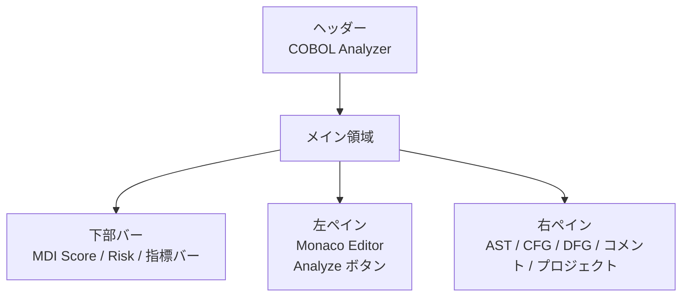
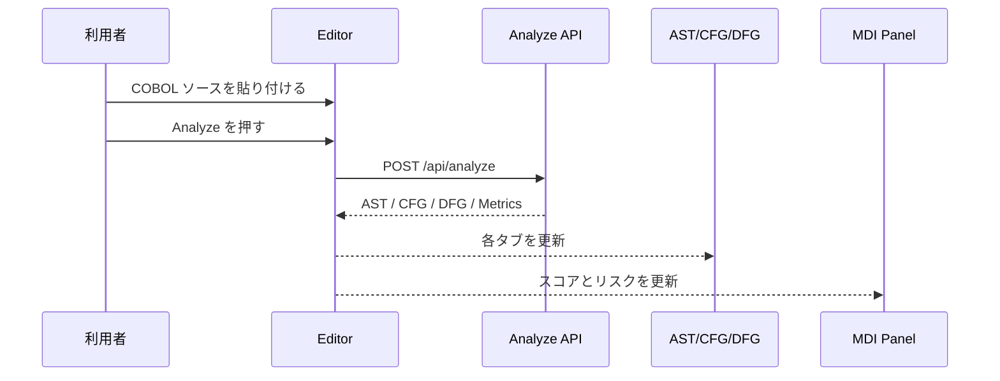
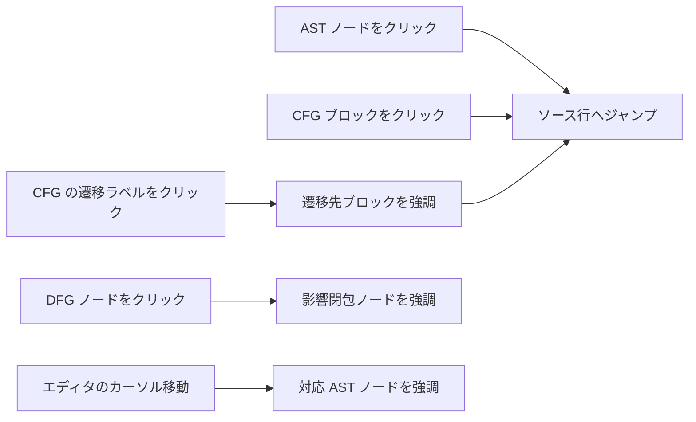
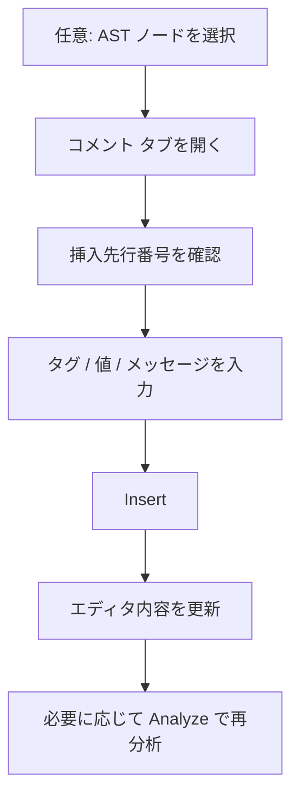
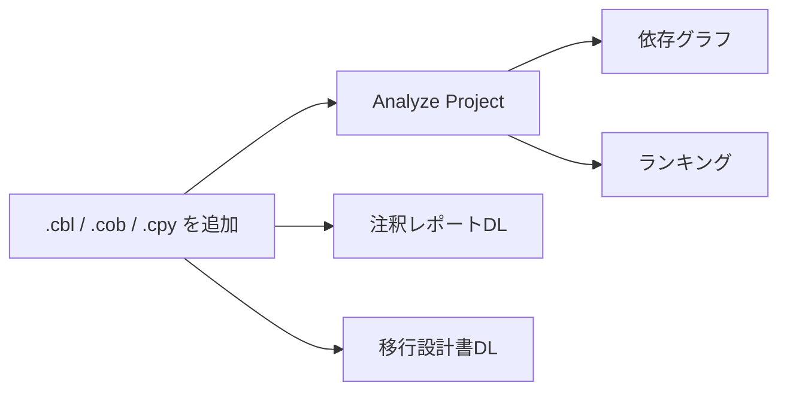

# COBOL Analyzer 操作説明書

本書は `implement/src/frontend` の現行画面を前提にした利用者向け手順書です。  
画面説明はスクリーンショットの代わりに `mermaid` 図で示します。

## 1. 起動手順

### 1.1 バックエンド API を起動する

`implement/` で次を実行します。

```powershell
dotnet run --project src\backend\CobolAnalyzer.API\CobolAnalyzer.API.csproj
```

- 既定の API URL は `http://localhost:5000`
- フロントエンドは既定でこの URL を参照します

### 1.2 フロントエンドを起動する

`implement/src/frontend` で次を実行します。

```powershell
npm install
npm run dev
```

- `npm install` は初回のみ必要です
- ブラウザでは Vite が表示した URL を開きます
  - 通常は `http://localhost:5173`

### 1.3 動作確認用のサンプル

- 単純な解析: `tests/CobolAnalyzer.Parser.Tests/TestData/hello.cbl`
- `GO TO` 遷移確認: `tests/CobolAnalyzer.Parser.Tests/TestData/goto-sample.cbl`
- DFG 影響確認: `tests/CobolAnalyzer.Parser.Tests/TestData/data-sample.cbl`
- 構文エラー表示確認: `tests/CobolAnalyzer.Parser.Tests/TestData/syntax-error.cbl`

## 2. 画面構成



### 2.1 各領域の役割

- 左ペイン: COBOL ソースの入力・編集を行います
- `Analyze`: 単一プログラム解析を実行します
- `AST` タブ: 構文木を表示します
- `CFG` タブ: 制御フローを表示します
- `DFG` タブ: データ依存を表示します
- `コメント` タブ: タグ付きコメントの挿入・削除を行います
- `プロジェクト` タブ: 複数ファイル解析、依存グラフ、ランキング、Markdown 出力を行います
- 下部バー: MDI スコア、リスク、指標内訳を表示します

## 3. 単一プログラムを解析する



### 3.1 基本手順

1. 左ペインに COBOL ソースを貼り付けます
2. `Analyze` を押します
3. 右ペインで `AST` `CFG` `DFG` を切り替えて結果を確認します
4. 下部の MDI バーで総合スコアとリスクを確認します

### 3.2 エディタ操作

- 通常の文字入力でソースを編集できます
- 右クリックで `Undo / Redo / Cut / Copy / Paste` のメニューを開けます
- `Ctrl+C`, `Ctrl+X`, `Ctrl+V` でも操作できます
- エディタ内でカーソル行を移動すると、対応する AST ノードが自動選択されます

## 4. AST / CFG / DFG の見方と操作

### 4.1 AST タブ

- ノード単クリック: 対応するソース行へジャンプし、行をハイライトします
- ノードダブルクリック: 子ノードを折りたたみ / 展開します
- ドラッグとホイール操作: 表示位置の移動と拡大縮小を行います
- ノード色:
  - `Structure`: 紺
  - `Unit`: 水色
  - `Element`: グレー

### 4.2 CFG タブ

- ブロック単クリック: 対応するソース行へジャンプします
- ブロック下の `→ GOTO`, `→ PERFORM`, `→ PERFORM_THRU`, `→ PERFORM_LOOP` をクリックすると遷移先ブロックへ移動します
- 背景をクリックすると選択状態を解除します
- ドラッグでブロック配置を調整できます
- 色の目安:
  - エントリブロック: 緑
  - エグジットブロック: オレンジ
  - `GoTo` エッジ: 紫の破線

### 4.3 DFG タブ

- データ項目ノードをクリックすると、影響を受けるノード群をハイライトします
- 背景をクリックすると選択状態を解除します
- ドラッグとホイール操作で表示を調整できます
- `REDEFINES` を持つノードは赤い枠で表示されます

### 4.4 双方向ナビゲーション



## 5. コメントを挿入・削除する



### 5.1 コメントを挿入する

1. 必要なら先に `AST` タブでノードを選択します  
   `コメント` タブを開いたとき、`挿入先行番号` に選択行が自動反映されます
2. `タグ種別` を選びます
3. `値` と `メッセージ` を入力します
4. `Insert` を押します
5. エディタのソースが更新されたことを確認します

補足:

- `CUSTOM` を選ぶと `カスタムタグ` 入力欄が表示されます
- 挿入後は自動再分析されません。新しい構造や MDI を見たい場合は `Analyze` を押してください

### 5.2 コメントを削除する

1. `正規表現パターン` を入力します
2. `Preview` を押して削除対象を確認します
3. 問題なければ `Remove` を押します
4. エディタのソースが更新されたことを確認します
5. 必要に応じて `Analyze` を押して再分析します

補足:

- 初期値は `\[MDI:.*?\]` です
- 正規表現が不正な場合は削除せず、エラーメッセージだけを表示します

## 6. プロジェクト解析を行う



### 6.1 ファイルを登録する

1. `プロジェクト` タブを開きます
2. COBOL ファイルをドラッグ&ドロップするか、ファイル入力欄から選択します
3. 右側の一覧にファイル名が表示されることを確認します

補足:

- 受け付ける拡張子は `.cbl`, `.cob`, `.cpy`
- 同名ファイルを追加すると既存内容を上書きします
- 51 件目以降は保持されず、先頭 50 件までに制限されます
- 一覧の `Remove` で個別に外せます

### 6.2 依存グラフとランキングを確認する

1. `Analyze Project` を押します
2. 既定表示の `依存グラフ` でプログラム間の `CALL` 関係を確認します
3. `ランキング` に切り替えて、MDI 順の移行優先度を確認します

依存グラフの見方:

- ノード内の数値は MDI スコアです
- ノード色はリスクに対応します
  - `Low`: 緑
  - `Medium`: 黄
  - `High`: オレンジ
  - `Critical`: 赤
  - 外部プログラム: グレー
- `循環依存あり` や `動的CALLあり` はグラフ上部に警告表示されます
- エッジ上の数字は `CALL` 箇所数です

ランキングの見方:

- `順位`, `プログラム`, `MDI`, `リスク`, `FanIn`, `FanOut`, `推奨戦略` を表示します
- `推奨戦略` にマウスを合わせると説明を確認できます

## 7. Markdown を出力する

### 7.1 注釈レポートを出力する

1. `プロジェクト` タブで対象ファイルを読み込みます
2. 上部の選択欄で対象ファイルを選びます
3. `注釈レポートDL` を押します
4. `{元ファイル名}-annotation-report.md` が生成されます

### 7.2 移行設計書を出力する

1. `プロジェクト` タブで対象ファイル群を読み込みます
2. `移行設計書DL` を押します
3. `migration-design.md` が生成されます

## 8. エラー時の見方

- 単一解析で構文エラーがある場合:
  - `AST`, `CFG`, `DFG` の各タブにエラー一覧を表示します
  - 図は描画されません
- API に接続できない場合:
  - タブ領域に `API error: ...` を表示します
- コメント削除で正規表現が不正な場合:
  - `コメント` タブの状態欄にエラーを表示します

## 9. 推奨操作順

1. `hello.cbl` で単一解析の流れを確認する
2. `goto-sample.cbl` で CFG の遷移ラベルを確認する
3. `data-sample.cbl` で DFG の影響ハイライトを確認する
4. コメント挿入後に `Analyze` を押して再分析の流れを確認する
5. 複数ファイルを `プロジェクト` タブに追加し、依存グラフとランキングを確認する
